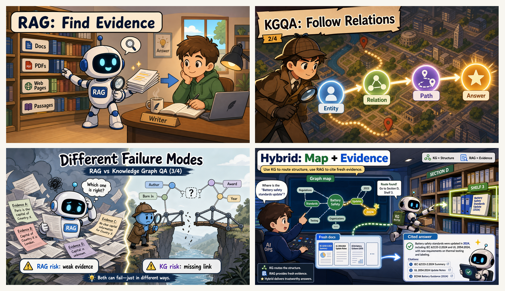
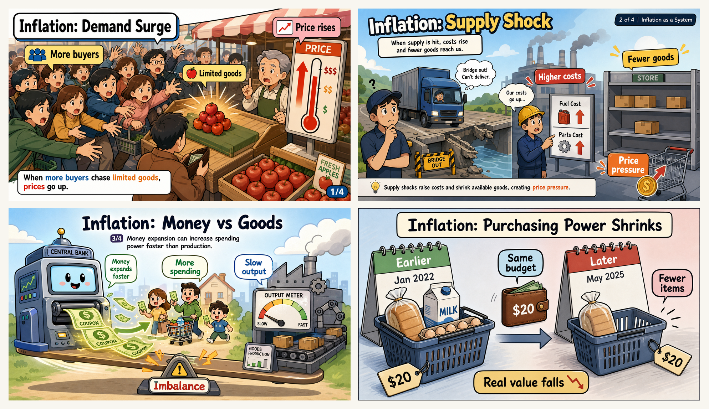
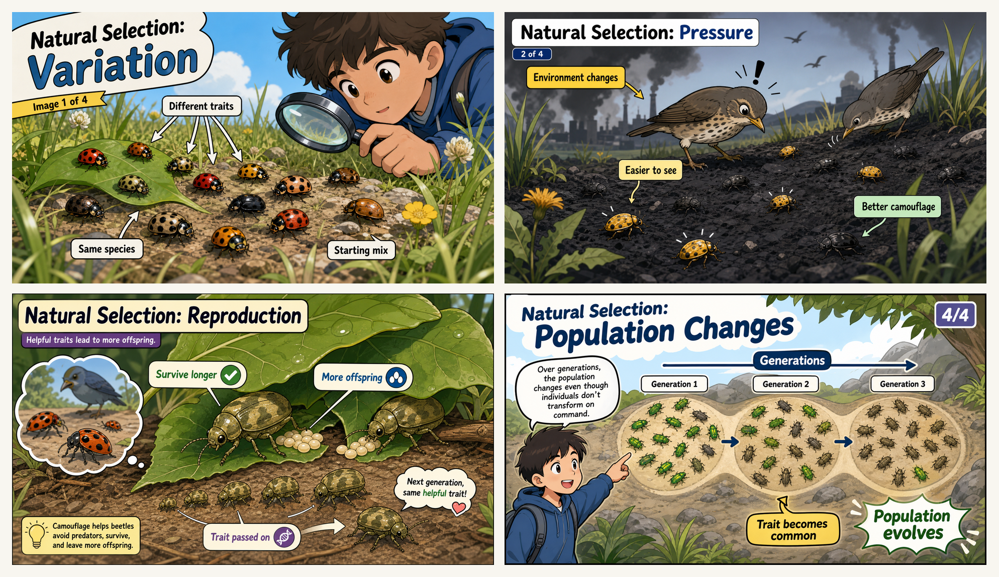

# Concept Comic 中文说明

<p align="center">
  <a href="./README.md">English</a> | <strong>简体中文</strong>
</p>

**Concept Comic** 是一个 AI skill，用来把复杂概念变成漫画式解释图。

## ✨ 特色

**🎯 按表达点规划张数**  
它不是按“主题”粗暴决定张数，而是按“表达点”规划。复杂概念会被拆成一组最小、清晰、容易快速读懂的视觉步骤。

**🧭 五维漫画 taxonomy**  
它不会从一个扁平的漫画类型表里随便选，而是先判断篇幅/形式、功能、叙事结构、风格壳层、发布渠道，再进入分镜。

**🧠 自动类型路由**  
用户给一个概念后，它会自动判断更适合单幅概念、对比解释、四格流程、对话澄清、因果/流程、系统地图、旅程/状态转移，还是短条漫。

**🧩 先理解结构，再决定画风**  
流程会先分析概念关系，再选择视觉隐喻和动作场景，最后才写生图 prompt。这样能减少“画面好看但没解释清楚”的问题。

**🛡️ 感知渠道、风格和风险**  
prompt 会带上受众、渠道、风险等级、偏好类型和风格壳层。高风险主题只做教育解释，类比会检查误导风险，公开传播时可以预留 AIGC 标识。

**📚 汇总成熟的视觉解释经验**  
它把漫画叙事、多媒体学习、双编码理论、图标可用性和 AI 生图 prompt 经验，整理成一个可复用流程。

**🔌 不绑定某一个编辑器**  
在 Codex 里，直接用当前环境的生图能力。其他编辑器如果没有内置生图能力，就配置图片 API 的密钥和地址。默认模型目标是 `gpt-image-2`。

```text
OPENAI_API_KEY      非原生生图环境必填
OPENAI_BASE_URL     可选，默认 https://api.openai.com/v1
OPENAI_IMAGE_MODEL  可选，默认 gpt-image-2
```

多图解释必须一张一张请求生成，不要让生图模型一次生成整套拼贴海报。

## 🧠 方法来源

这个 skill 汇总了几类公开经验，并把它们改写成可执行的漫画生图流程：

- **漫画与序列艺术**：Scott McCloud 关于漫画沟通、通过简化放大意义的思想。参考 [Understanding Comics overview](https://www.ebsco.com/research-starters/literature-and-writing/understanding-comics-invisible-art-scott-mccloud) 和 [Cleveland Public Library toolkit](https://cpl.org/wp-content/uploads/comic-discussion-guide-Understanding-Comics-Toolkit-11x17-Booklet.pdf)。
- **多媒体学习**：Mayer 的原则支持去掉无关细节、让标签靠近图像、用视觉提示引导注意力。参考 Cambridge Handbook 中关于 [coherence, signaling, redundancy, spatial contiguity](https://www.cambridge.org/core/books/cambridge-handbook-of-multimedia-learning/principles-for-reducing-extraneous-processing-in-multimedia-learning-coherence-signaling-redundancy-spatial-contiguity-and-temporal-contiguity-principles/CD5B7AE1279A9AB81F8EEBB53DBEC86E) 的章节。
- **双编码理论**：Paivio 的双编码理论解释了为什么短文字标签要和强视觉表示配合。参考 [Dual Coding Theory and Education](https://nschwartz.yourweb.csuchico.edu/Clark%20%26%20Paivio.pdf)。
- **图标与标签可用性**：NN/g 关于图标可用性的建议支持“短标签、可识别图标、避免无标签符号”。参考 [Icon Usability](https://www.nngroup.com/articles/icon-usability/) 和 [Yes, Icons Need Text Labels](https://www.nngroup.com/videos/icon-text-labels/)。
- **AI 生图 prompt 经验**：把上面的方法落到 prompt 规则里，比如短标签、可见动作、先隐喻后构图、避免密集信息图和 PPT 化版式。

## 🖼️ 真实生成示例

### RAG 与知识图谱问答

四个表达点：检索证据、沿关系推理、失败模式、混合使用。



### 通胀作为一个系统

四个表达点：需求上涨、供给冲击、货币与商品、购买力下降。



### 自然选择

四个表达点：差异、选择压力、繁殖、群体变化。



## 🚀 使用方式

```text
用 Concept Comic 解释 RAG 和知识图谱问答的区别。
```

期望行为：

```text
1. 先规划需要几张漫画。
2. 生成对应数量的独立漫画图片文件。
3. 返回图片路径。
```

输出约束：

```text
一个表达点 = 一张漫画。
一个点讲不清，就拆成多张。
规划 N 张图，就交付 N 个独立生成图片文件。
最终产物是漫画图片，不是文字解释。
```

## 📦 Skill 内容

```text
concept-comic/
├─ SKILL.md                         # skill 主入口，包含触发信息和核心执行规则。
├─ agents/                          # skill 列表和快捷入口使用的界面元数据。
│  └─ openai.yaml                   # 展示名称、短描述和默认提示词。
├─ references/                      # 按需读取的工作流参考文档。
│  ├─ concept-understanding.md      # 如何提取核心概念和解释目标。
│  ├─ concept-types.md              # 五维 taxonomy 和自动路由规则。
│  ├─ concept-to-metaphor.md        # 抽象结构转视觉隐喻的规则。
│  ├─ metaphor-bank.md              # 可复用的隐喻模式库。
│  ├─ comic-grammar.md              # 漫画构图、角色、动作、标签和节奏。
│  ├─ composition-patterns.md       # 视觉结构、风格壳层和渠道适配布局。
│  ├─ storyboard-template.md        # 每张漫画的分镜字段模板。
│  ├─ prompt-template.md            # taxonomy、渠道、风险和风格字段模板。
│  ├─ image-generation-workflow.md  # 生图路线、张数规划和画幅处理。
│  ├─ external-image-api.md         # 其他编辑器没有生图能力时的 API 方案。
│  ├─ qa-checklist.md               # 概念、taxonomy、渠道、风格、安全和张数检查。
│  ├─ anti-patterns.md              # 密集信息图、合并多图等常见失败模式。
│  ├─ domain-safety.md              # 高风险模式、类比边界、AIGC 标识和版权风格安全。
│  ├─ response-format.md            # 最终回复格式和图片路径报告方式。
│  └─ visual-style.md               # 可读漫画图的默认视觉风格。
├─ examples/                        # 常见概念请求的文字示例 brief。
│  ├─ black-hole.md                 # 科学概念示例。
│  ├─ entropy.md                    # 熵概念示例。
│  ├─ immune-system.md              # 类比型过程示例。
│  ├─ inflation.md                  # 经济系统示例。
│  ├─ natural-selection.md          # 跨代变化概念示例。
│  ├─ opportunity-cost.md           # 决策概念示例。
│  ├─ path-dependence.md            # 历史路径锁定示例。
│  ├─ prisoner-dilemma.md           # 博弈论示例。
│  ├─ rag-vs-kgqa.md                # AI 架构对比示例。
│  └─ water-cycle.md                # 物理过程示例。
├─ tests/                           # 用来检查 skill 行为的压力提示词。
│  └─ sample-prompts.md             # 覆盖张数规划和输出规则的请求样例。
├─ docs/                            # 面向仓库阅读者的补充文档。
│  ├─ gallery.md                    # 示例输出图库说明。
│  ├─ showcase.md                   # 生成示例展示说明。
│  └─ usage.md                      # 额外使用说明。
└─ assets/                          # README、docs 和示例使用的图片资源。
   ├─ cover.png                     # 封面图资源。
   ├─ previews/                     # 旧示例主题的小预览图。
   │  ├─ entropy-preview.png        # 熵预览图。
   │  └─ opportunity-cost-preview.png # 机会成本预览图。
   └─ examples/                     # 生成漫画示例和 README 四宫格。
      ├─ .gitkeep                   # 确保空目录也能被 Git 保留。
      ├─ rag-vs-kgqa-grid.png       # 四张漫画组成的预览图。
      ├─ inflation-system-grid.png  # 四张漫画组成的预览图。
      ├─ natural-selection-grid.png # 四张漫画组成的预览图。
      ├─ rag-vs-kgqa/               # RAG 与 KGQA 的 4 张独立漫画。
      │  ├─ 01-rag-find-evidence.png
      │  ├─ 02-kgqa-follow-relations.png
      │  ├─ 03-different-failure-modes.png
      │  └─ 04-hybrid-map-evidence.png
      ├─ inflation-system/          # 通胀系统的 4 张独立漫画。
      │  ├─ 01-demand-surge.png
      │  ├─ 02-supply-shock.png
      │  ├─ 03-money-vs-goods.png
      │  └─ 04-purchasing-power.png
      └─ natural-selection/         # 自然选择的 4 张独立漫画。
         ├─ 01-variation.png
         ├─ 02-selection-pressure.png
         ├─ 03-reproduction.png
         └─ 04-population-changes.png
```

## License

MIT
